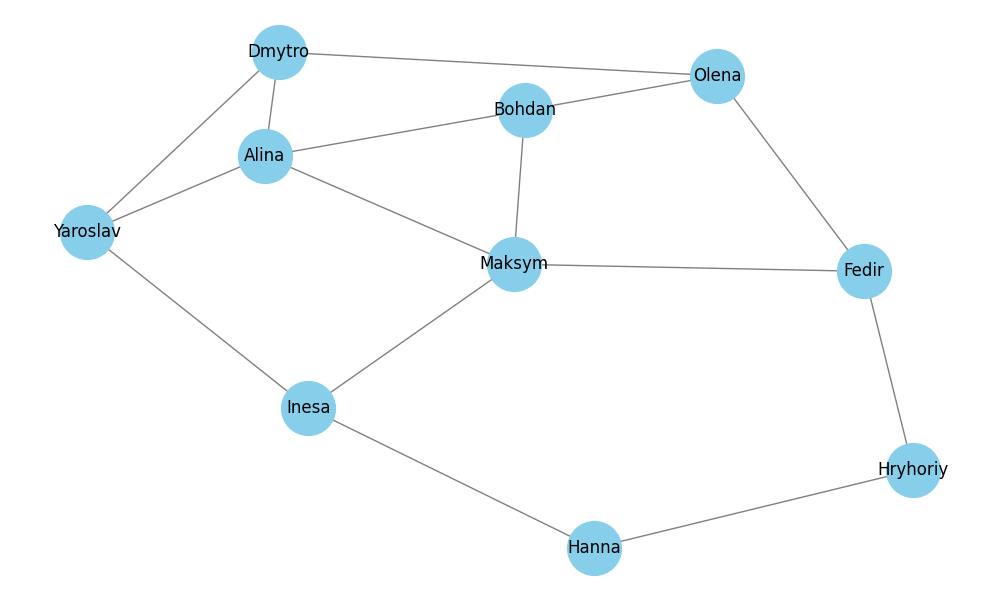
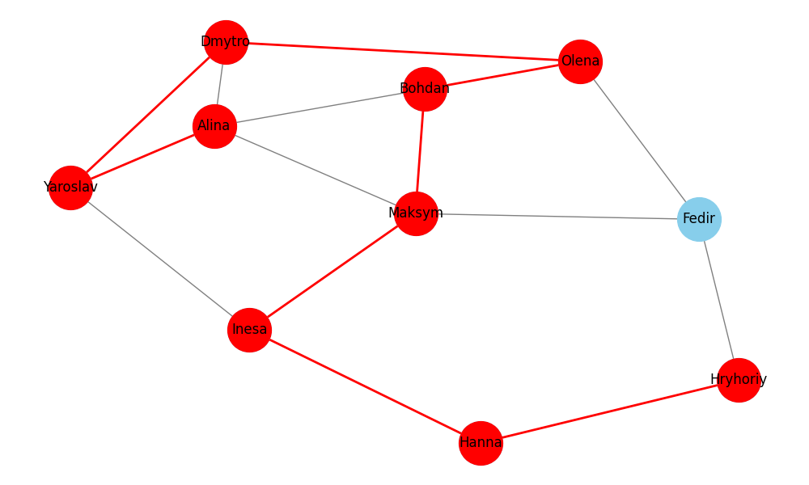
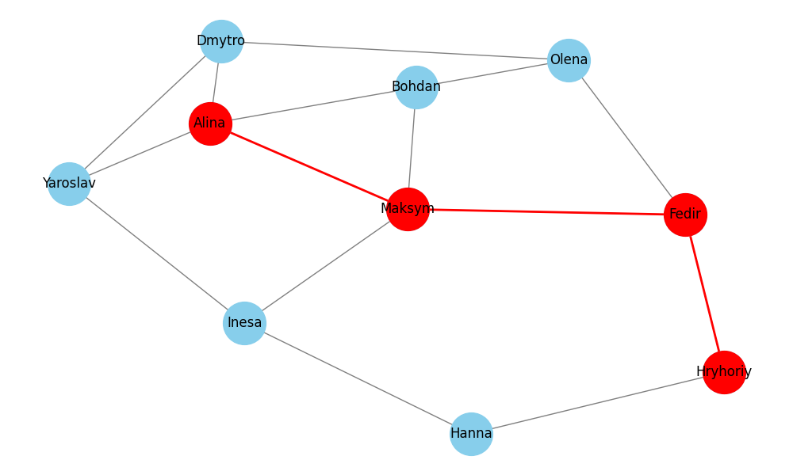

# goit-algo-hw-06
Graphs

**Порівняння результатів алгоритмів DFS та BFS**
================================================
*На прикладі моделі соціальної мережі*

Обидва алгоритми, знаходять шлях від "Alina" до "Hryhoriy", але шляхи відрізняються:

* **DFS:** `['Alina', 'Yaroslav', 'Dmytro', 'Olena', 'Bohdan', 'Maksym', 'Inesa', 'Hanna', 'Hryhoriy']`

* **BFS:** `['Alina', 'Maksym', 'Fedir', 'Hryhoriy']`

Це пов'язано з різними стратегіями пошуку, які використовують алгоритми:

* **DFS:** DFS досліджує граф глибиною, слідуючи одним шляхом до кінця, перш ніж перейти до іншого. У цьому випадку він спочатку йде від "Alina" до "Yaroslav", потім до "Dmytro" і так далі, поки не досягне "Hryhoriy".
* **BFS:** BFS досліджує граф по ширині, переглядаючи всі вершини на одному рівні, перш ніж перейти до наступної. У цьому випадку він спочатку досліджує всіх сусідів "Alina", потім сусідів цих вершин, і так далі, поки не досягне "Hryhoriy".

У цьому прикладі BFS знаходить значно коротший шлях, який містить спільних друзів ("Maksym" та "Fedir"). 

**Висновоки**
------------

1. Використання BFS має сенс при пошуку спільних друзів або найефективніших маршрутів у соціальній мережі, а DFS може бути корисним, якщо необхідно дослідити всі можливі шляхи між двома користувачами, навіть якщо ці шляхи не найкоротші.

2. Вибір між DFS та BFS залежить від конкретних потреб та контексту задачі. Обидва алгоритми мають свої сильні та слабкі сторони, і розуміння їхніх характеристик є ключовим для вибору найкращого підходу для конкретної ситуації.
